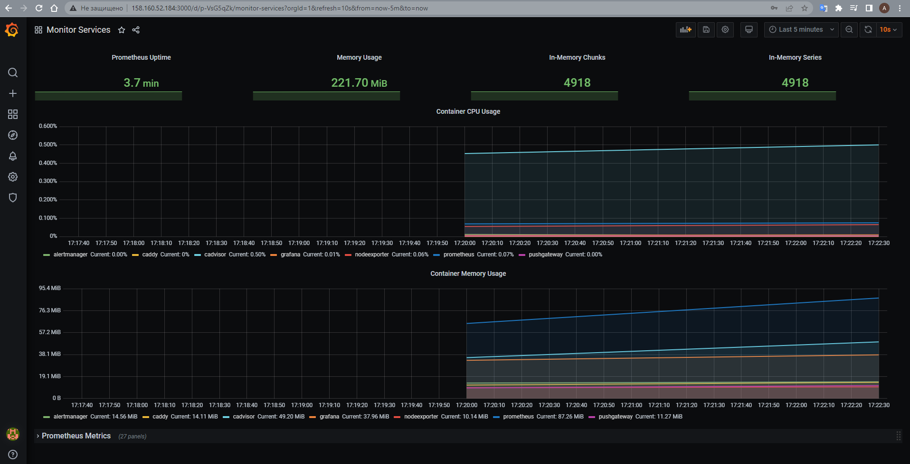

# Домашнее задание к занятию "4. Оркестрация группой Docker контейнеров на примере Docker Compose"

## Как сдавать задания

Обязательными к выполнению являются задачи без указания звездочки. Их выполнение необходимо для получения зачета и диплома о профессиональной переподготовке.

Задачи со звездочкой (*) являются дополнительными задачами и/или задачами повышенной сложности. Они не являются обязательными к выполнению, но помогут вам глубже понять тему.

Домашнее задание выполните в файле readme.md в github репозитории. В личном кабинете отправьте на проверку ссылку на .md-файл в вашем репозитории.

Любые вопросы по решению задач задавайте в чате учебной группы.

---


## Важно!

Перед отправкой работы на проверку удаляйте неиспользуемые ресурсы.
Это важно для того, чтоб предупредить неконтролируемый расход средств, полученных в результате использования промокода.

Подробные рекомендации [здесь](https://github.com/netology-code/virt-homeworks/blob/virt-11/r/README.md)

---

## Задача 1

Создать собственный образ  любой операционной системы (например, ubuntu-20.04) с помощью Packer ([инструкция](https://cloud.yandex.ru/docs/tutorials/infrastructure-management/packer-quickstart))

Для получения зачета вам необходимо предоставить скриншот страницы с созданным образом из личного кабинета YandexCloud.

## Задача 2

Создать вашу первую виртуальную машину в YandexCloud с помощью terraform. 
Используйте terraform код в директории ([src/terraform](https://github.com/netology-group/virt-homeworks/tree/virt-11/05-virt-04-docker-compose/src/terraform))

Для получения зачета, вам необходимо предоставить вывод команды terraform apply и страницы свойств созданной ВМ из личного кабинета YandexCloud.
```shell
Do you want to perform these actions?
  Terraform will perform the actions described above.
  Only 'yes' will be accepted to approve.

  Enter a value: yes

yandex_vpc_network.default: Creating...
yandex_vpc_network.default: Creation complete after 1s [id=enpibhqck08n4lbumben]
yandex_vpc_subnet.default: Creating...
yandex_vpc_subnet.default: Creation complete after 1s [id=e9bq7g8m5em3m42906kk]
yandex_compute_instance.node01: Creating...
yandex_compute_instance.node01: Still creating... [10s elapsed]
yandex_compute_instance.node01: Still creating... [20s elapsed]
yandex_compute_instance.node01: Still creating... [30s elapsed]
yandex_compute_instance.node01: Still creating... [40s elapsed]
yandex_compute_instance.node01: Still creating... [50s elapsed]
yandex_compute_instance.node01: Still creating... [1m0s elapsed]
yandex_compute_instance.node01: Creation complete after 1m7s [id=fhmkbssoa65p7kvks5es]

Apply complete! Resources: 3 added, 0 changed, 0 destroyed.

Outputs:

external_ip_address_node01_yandex_cloud = "158.160.52.184"
internal_ip_address_node01_yandex_cloud = "192.168.101.32"
alex@DESKTOP-SBHASL4:~/homework$ yc compute instance list
+----------------------+--------+---------------+---------+----------------+----------------+
|          ID          |  NAME  |    ZONE ID    | STATUS  |  EXTERNAL IP   |  INTERNAL IP   |
+----------------------+--------+---------------+---------+----------------+----------------+
| fhmkbssoa65p7kvks5es | node01 | ru-central1-a | RUNNING | 158.160.52.184 | 192.168.101.32 |
+----------------------+--------+---------------+---------+----------------+----------------+
```
## Задача 3

С помощью ansible и docker-compose разверните на виртуальной машине из предыдущего задания систему мониторинга на основе Prometheus/Grafana .
Используйте ansible код в директории ([src/ansible](https://github.com/netology-group/virt-homeworks/tree/virt-11/05-virt-04-docker-compose/src/ansible))

Для получения зачета вам необходимо предоставить вывод команды "docker ps" , все контейнеры, описанные в ([docker-compose](https://github.com/netology-group/virt-homeworks/blob/virt-11/05-virt-04-docker-compose/src/ansible/stack/docker-compose.yaml)),  должны быть в статусе "Up".
```shell
alex@DESKTOP-SBHASL4:~/homework/ansible$ ssh alex@158.160.52.184
Welcome to Ubuntu 20.04.5 LTS (GNU/Linux 5.4.0-137-generic x86_64)

 * Documentation:  https://help.ubuntu.com
 * Management:     https://landscape.canonical.com
 * Support:        https://ubuntu.com/advantage
Last login: Tue Jan 31 14:18:22 2023 from 62.183.30.125
alex@node01:~$ sudo docker ps
CONTAINER ID   IMAGE                              COMMAND                  CREATED          STATUS                             PORTS                                       
                                                                  NAMES
866940fc8ad1   prom/prometheus:v2.17.1            "/bin/prometheus --c…"   36 seconds ago   Up 15 seconds                      9090/tcp                                    
                                                                  prometheus
942f5c0e1f1d   grafana/grafana:7.4.2              "/run.sh"                36 seconds ago   Up 15 seconds                      3000/tcp                                    
                                                                  grafana
f2d1b4b8351d   gcr.io/cadvisor/cadvisor:v0.47.0   "/usr/bin/cadvisor -…"   36 seconds ago   Up 15 seconds (health: starting)   8080/tcp                                    
                                                                  cadvisor
f8240aadd9cd   prom/node-exporter:v0.18.1         "/bin/node_exporter …"   36 seconds ago   Up 15 seconds                      9100/tcp                                    
                                                                  nodeexporter
9fc8484a23bf   prom/alertmanager:v0.20.0          "/bin/alertmanager -…"   36 seconds ago   Up 15 seconds                      9093/tcp                                    
                                                                  alertmanager
d09de0600c0b   prom/pushgateway:v1.2.0            "/bin/pushgateway"       36 seconds ago   Up 15 seconds                      9091/tcp                                    
                                                                  pushgateway
026a50428705   caddy:2.3.0                        "caddy run --config …"   36 seconds ago   Up 15 seconds                      80/tcp, 443/tcp, 0.0.0.0:3000->3000/tcp, 0.0.0.0:9090-9091->9090-9091/tcp, 2019/tcp, 0.0.0.0:9093->9093/tcp   caddy
alex@node01:~$
```
## Задача 4

1. Откройте веб-браузер, зайдите на страницу http://<внешний_ip_адрес_вашей_ВМ>:3000.
2. Используйте для авторизации логин и пароль из ([.env-file](https://github.com/netology-group/virt-homeworks/blob/virt-11/05-virt-04-docker-compose/src/ansible/stack/.env)).
3. Изучите доступный интерфейс, найдите в интерфейсе автоматически созданные docker-compose панели с графиками([dashboards](https://grafana.com/docs/grafana/latest/dashboards/use-dashboards/)).
4. Подождите 5-10 минут, чтобы система мониторинга успела накопить данные.

Для получения зачета, вам необходимо предоставить: 
- Скриншот работающего веб-интерфейса Grafana с текущими метриками, как на примере ниже
<p align="center">
  
</p>

