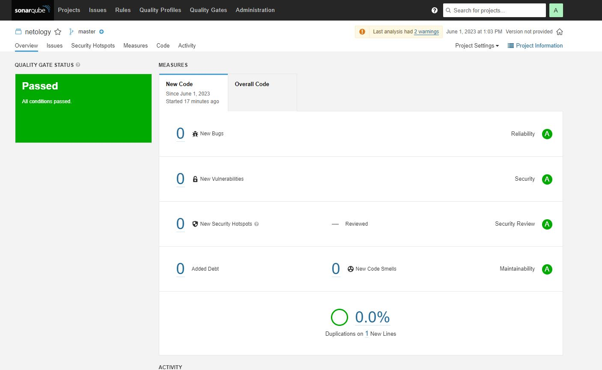

# Домашнее задание к занятию "9.Процессы CI/CD"
## SonarQube
Результат сканирования исправленного кода:  
  

## Nexus
Файл [maven-metadata.xml](./pic/maven-metadata.xml).

## Maven
Исправленный файл [pom.xml](./pic/pom.xml).